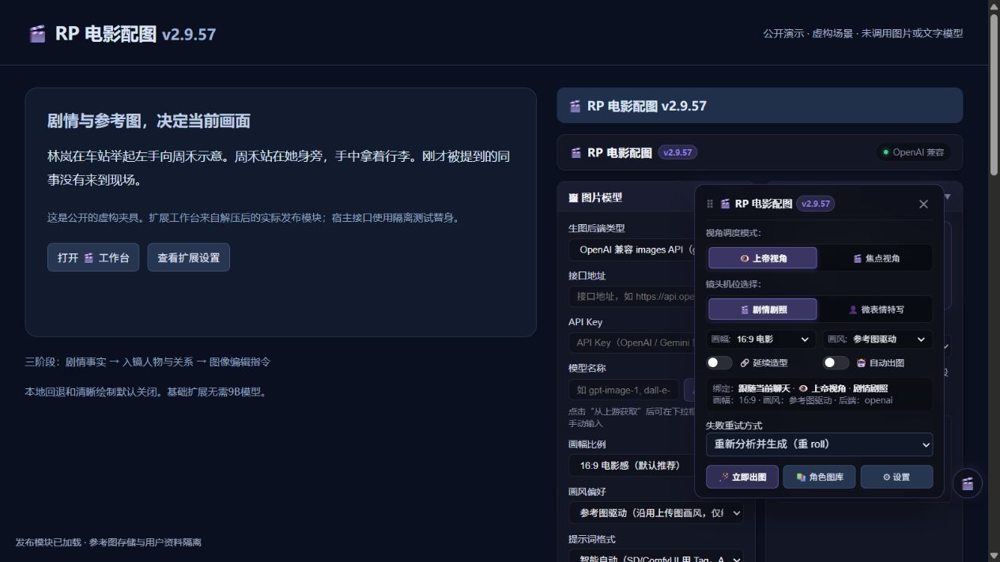

# RP 电影配图 v2.9.57：按剧情和人物参考图生成配图，可选本地文字回退

这是一个 MIT 开源的 SillyTavern 前端扩展。先提取当前剧情事实，核对实际入镜人物、动作归属和空间关系，再生成英文图像编辑指令；结合每个人物自己的参考图生成剧照、表情特写和角色设计图。

仓库：[RP 电影配图](https://github.com/wangjinmiao147-dotcom/rp-cinematic-imagegen)

下载：[v2.9.57 Release](https://github.com/wangjinmiao147-dotcom/rp-cinematic-imagegen/releases/tag/v2.9.57)

截图来自实际发布模块和隔离宿主接口，仅含虚构场景，未调用模型。

## 普通用户怎么安装

酒馆 → 扩展 → 安装扩展，粘贴仓库地址，安装后刷新。配置自己的文字接口和图片后端，为各人物导入参考图，再点消息上的 🎬 或悬浮工作台生成。

也可下载基础扩展 ZIP，解压 `rp-cinematic-imagegen` 到酒馆用户的 `extensions` 目录；已用酒馆助手的用户可导入 Release 中的安装器 JSON 为全局脚本并启用。

**基础扩展不要求 Ollama 或 9B 模型，不要求安装服务器插件。** 本地图片服务只是一种后端选择，需自行配置。其他可用后端包括 OpenAI 兼容、Gemini、SD WebUI、ComfyUI 和酒馆内置 SD；多参考图能力取决于对应接口。

## 主要功能

- 只把有身体入镜依据的人物放进画面；仅被提及或在画外的人物不自动加进来。
- 区分别名与独立人物，各用自己的参考图；User 三视图 / 多视角参考与角色卡分库。
- 参考图提供身份和画风，当前动作、服装、道具和机位来自剧情；生成前可检查名单和提示词。
- 图库、灯箱、多图导入导出、失败重试、任务队列和取消；桌面与手机使用同一工作台。
- “清晰绘制，最终512”可选：普通16:9本地Qwen参考场景生成一次1024×576，再完整缩至512×288；默认关闭，镜面和倒影仍走原绘制档。
- 当前绑定世界书的明确年龄字段参与分析，不使用旧内嵌副本覆盖当前上下文。

## v2.9.57 的可选本地回退

默认关闭。每个分析阶段先走主文字接口，失败时只把当前阶段交给本地模型，下一阶段重新优先主接口。取消不会启动本地推理；云端密钥不转发，本地结果也要校验。

想用该功能再下载独立本地服务 ZIP，按 [安装说明](https://github.com/wangjinmiao147-dotcom/rp-cinematic-imagegen/blob/main/tools/local-scene-llm/README.md) 安装 Node.js、Ollama 和自己的模型。包里没有权重、私人配置或日志，也不会自动下载模型。当前验证范围为 Windows + NVIDIA，6GB显存通过部分GPU层与CPU配合使用9B Q4_K_M，不是全量驻留GPU。

默认只监听本机，酒馆端口改变需调整跨域来源。手机的127.0.0.1指手机自身，默认本地服务不能直接当手机远程方案。

## 示例与边界

虚构用例：林岚和周禾在车站，林岚举左手示意，周禾持行李，被提及的同事不在现场。分别提供两人的参考图，预览时核对人数、行李和机位。

图像与文字模型仍可能失败。限定镜面和姿态引导不能保证所有镜面、手部、持物或多人场景都正确；本地回退也不保证任何输入都能完成。自动化测试不代表所有手机实机验证。发布包不包含私人配置、聊天、角色卡、生成图、模型权重或缓存。

问题反馈请附版本、后端、可公开复现步骤和错误码，先删除密钥及私人剧情。详细限制见 [README](https://github.com/wangjinmiao147-dotcom/rp-cinematic-imagegen#readme)。
